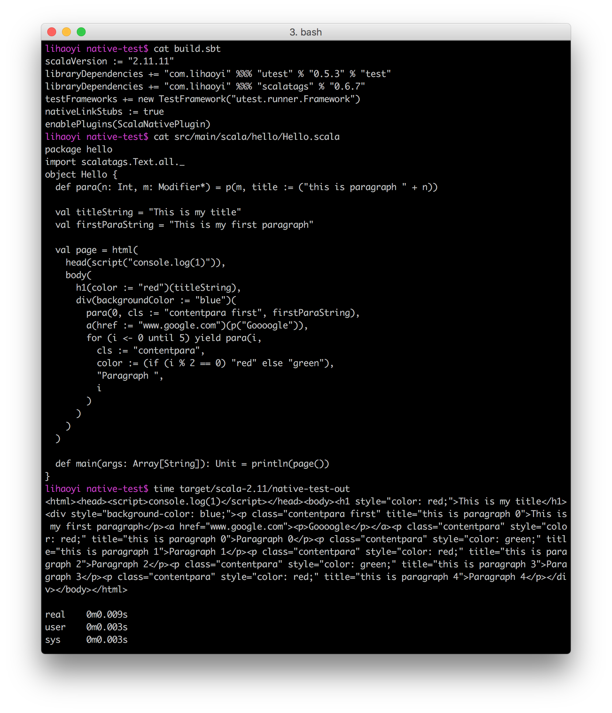
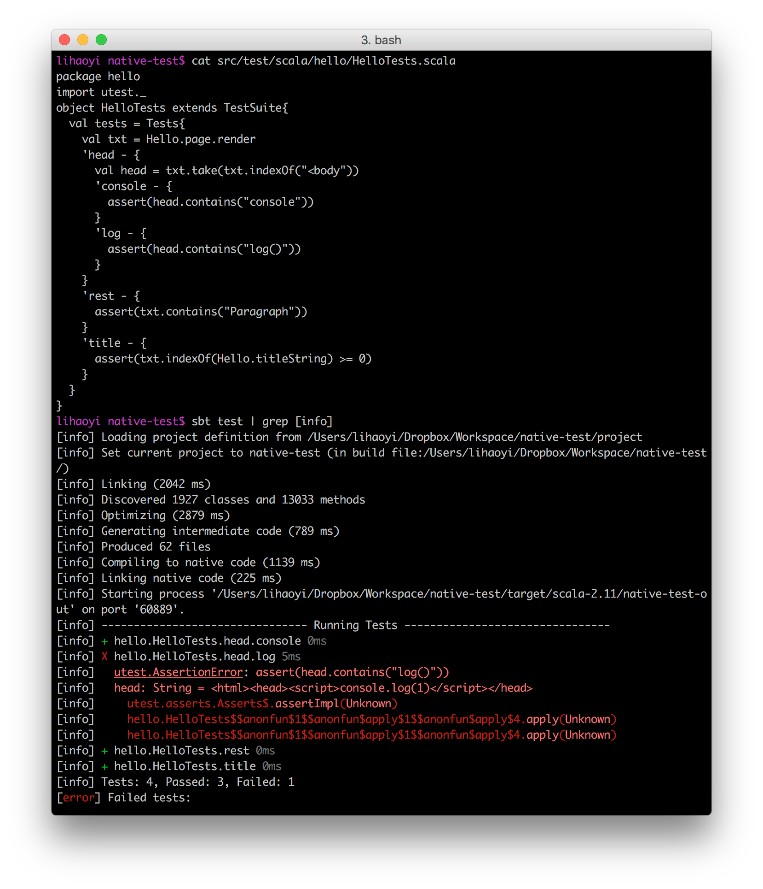

# scala-native-example-app

An example project showing how to use Scala-Native in SBT, together with third
party libraries (in this case [Scalatags](https://github.com/lihaoyi/scalatags))
and a test suite (using [uTest](https://github.com/lihaoyi/utest)).

## Installing Scala-Native

First, you need to install Scala-Native's external dependencies. This is
described here for each operating system:

- http://www.scala-native.org/en/latest/user/setup.html

This should be relatively straightforward and not cause any problems. Make sure
you install the packages labeled `optional`, as they are required for this
project.

## Using this project

You should be able to import this project into IntelliJ-IDEA or any other Scala
IDE or editor without issue.

To compile-and-run:

```
sbt run
```

To build an executable without running:

```
sbt nativeLink
```

To then run that executable:

```
./target/scala-2.11/scala-native-example-app-out
```

This should look like:



To run tests:

```
sbt test
```

This should look like:



You can of course use the full functionality of uTest to
[select which tests to run](https://github.com/lihaoyi/utest#running-tests).

## That's it!

That's all that is necessary to try using this project. Feel free to try
building larger applications using Scala-Native using this template, or trying
out some of the other third-party libraries that are available for Scala-Native:

```scala
"com.lihaoyi" %%% "utest" % "0.5.3"
"com.lihaoyi" %%% "sourcecode" % "0.1.4"
"com.lihaoyi" %%% "fastparse" % "0.4.4"
"com.lihaoyi" %%% "fansi" % "0.2.5"
"com.lihaoyi" %%% "scalatags" % "0.6.7"
"com.lihaoyi" %%% "pprint" % "0.5.3"
```
